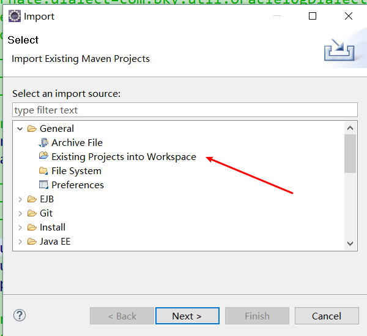
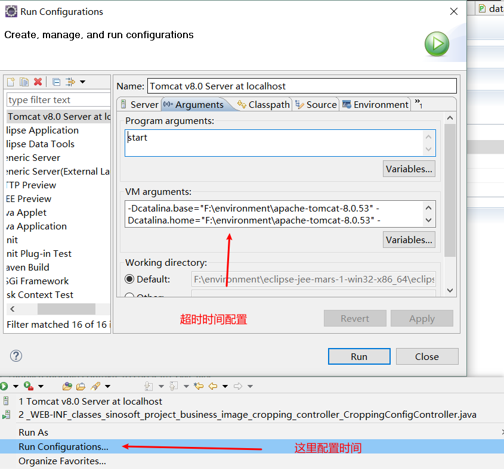

####  1. 导入项目

可能存在的问题:未发现项目.

解决: 尝试选取maven 导入maven项目,因为.classpath和.project缺失

#### 2. 如果是maven项目,则转为maven项目

如果有,则有convert to maven project

#### 3.配置maven,jdk,tomcat,jre版本

argument vmargument 添加-Xms256M -Xmx512M -XX:PermSize=256m -XX:MaxPermSize=512m

**注意:** java compiler 以及project facets 常常因不知名原因初始化,每次检查!

#### 4.出现问题
##### (1)jdk版本不对
需要重新安装对应版本,安装jdk会有相应的jre

如果没有 则是因为曾经下载过,未卸载干净.重新卸载.
##### (2)下载的tomcat startup.bat启动不了 的解决方法 
https://blog.csdn.net/Klhz555/article/details/92833088
##### (3)下载的tomcat startup.bat启动 一闪而过 的解决方法 
https://blog.csdn.net/Klhz555/article/details/92833088

#### 5.还不行的话
删除项目重新从SVN下载导入
`F:\work-project-space\DFNissanfc20.9.8\.metadata\.plugins\org.eclipse.core.resources\.projects`
在文件夹中删除项目才算全部删除